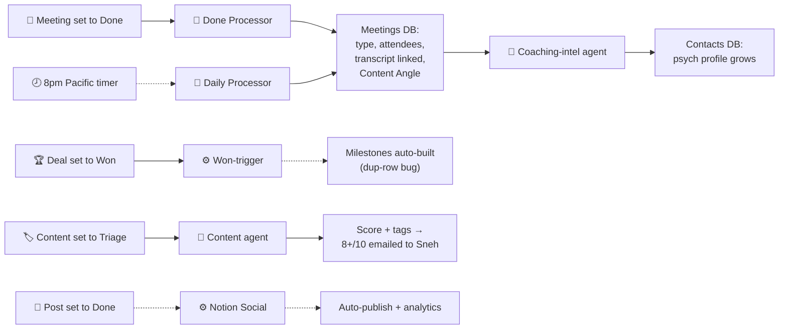

# 🤖 Agents & Automations — Brad's Robots

> **The part of the system that works while you're asleep.** Brad built two kinds of robot into your Notion: **Automations** (dumb, reliable "when X → do Y" rules) and **AI Agents** (smart helpers that read, judge, and write). This page is the field guide to every one — what fires it, what it does, and whether it's actually running.

<callout icon="⚖️" color="blue_bg">
	**The line Brad drew (and it's a good one):** *"Automations are for consistency; AI agents are for creative tasks that vary each time."* So stamping a date or spawning a checklist = automation. Summarizing a call or scoring a content idea = agent. Keep this distinction and you'll always know which tool to reach for.
</callout>

## 🔁 The whole robot layer in one picture {color="blue_bg"}
---
Triggers on the left, robots in the middle, what they touch on the right. Solid = reliable, dashed = flaky or idle.

## ⚙️ The Automations (dumb but reliable) {color="blue_bg"}
---
These are plain Notion rules. No AI, no judgment — which is exactly why they're trustworthy.
<table fit-page-width="true" header-row="true">
<tr><td>**Automation**</td><td>**Fires when…**</td><td>**Then it…**</td><td>**Status**</td></tr>
<tr><td>**Won → build the engagement**</td><td>A deal's Status flips to **Won**</td><td>Auto-creates that offer's milestones + dates from the Milestones Calendar template</td><td>🟡 Works, but spawns duplicate ledger rows (blank scaffold + narrative) — a known bug</td></tr>
<tr><td>**Closed-won date stamp**</td><td>A deal is won</td><td>Records the Won date so month-end revenue math is right</td><td>🟢 Fixed at button-up (was corrupting the dashboard)</td></tr>
<tr><td>**Content Triage enrichment**</td><td>A content item's Status → **Triage**</td><td>Kicks the content agent (summary, usefulness score, tags)</td><td>🟢 Live — Lou reviews weekly</td></tr>
<tr><td>**Notion Social auto-publish**</td><td>A post is set to **Done**</td><td>Publishes at the scheduled time and syncs analytics back</td><td>⚪ Built; lightly/never used</td></tr>
<tr><td>**Meeting auto-link**</td><td>A meeting is processed</td><td>Associates (never moves) the transcript to the right deal + contact</td><td>🟢 Live since Apr 22 · misses external-domain calls</td></tr>
</table>

## 🤖 The AI Agents (smart helpers) {color="blue_bg"}
---
These read, judge, and write. More powerful, but they need watching — they're where the "it's 80% there" feeling lives.
<table fit-page-width="true" header-row="true">
<tr><td>**Agent**</td><td>**Job**</td><td>**Status**</td></tr>
<tr><td>**Meeting "Done Processor"**</td><td>The instant you mark a call Done: tags call type (sales / AI / internal), fills attendees, links the transcript to its deal, and extracts a **Content Angle**</td><td>🟢 The workhorse — runs constantly</td></tr>
<tr><td>**Meeting "Daily Processor"**</td><td>An 8pm-Pacific sweep that catches any call the Done Processor missed (Notion can't react to outside events in real time, so this safety-net timer exists)</td><td>🟢 Live</td></tr>
<tr><td>**Content Curator**</td><td>On triage: extracts type / theme / channel / summary + a usefulness score out of 10; 8+/10 ideas get emailed to Sneh twice a week</td><td>🟢 Content is good; the Thursday-draft/Friday-send handoff double-works (see Machine audit)</td></tr>
<tr><td>**Coaching Intelligence**</td><td>Reads coaching-client transcripts and quietly grows a profile on the contact — values, decision patterns, personal details — so prep is warm</td><td>🟢 Live · genuinely tailored to your 1:1 product</td></tr>
<tr><td>**Idea / Insight Miner**</td><td>Brad's skill (May): mines your databases for content, training, and product ideas and outputs a digest (optional emailed PDF)</td><td>🟡 Delivered; overlaps with Iris's scouting now</td></tr>
<tr><td>**Trade-Association Outreach**</td><td>A fast-tracked agent for speaking-gig lead-gen</td><td>⚪ Built as an isolated deliverable; usage unclear</td></tr>
<tr><td>**Contacts Manager**</td><td>Keeps the contact database tidy</td><td>🔴 Disabled (you turned it off to cut cost — Brad advised against cost-tuning mid-build)</td></tr>
<tr><td>**The 14 "AI Actors" + 8 Workflows**</td><td>Brad's reusable @mentionable AI library in the AI Hub</td><td>⚰️ Idle since Apr 3 — superseded by Iris + skills. See Dead Weight.</td></tr>
</table>

## 🔍 Two things worth understanding {color="blue_bg"}
---

**Why there are TWO meeting robots (not one)**

	Notion has no "webhooks" — it can't be poked by an outside event the moment it happens. So Brad built a pair: the **Done Processor** fires immediately when *you* manually mark a meeting Done, and the **Daily Processor** runs on a nightly timer to sweep up anything you forgot to mark. Belt and suspenders. It's a workaround for a Notion limitation, not over-engineering.

**Why the Won-trigger sometimes makes duplicates**

	When a deal is won, the automation builds the engagement scaffold *and* the narrative sometimes creates a second row, so the pipeline can double-count. The rule of thumb your system already follows: **update the canonical narrative row, flag the blank scaffold to Lou.** A small de-dupe rule would end this for good (it's in the Notion Fix Track).

## 🩹 What's missing (worth adding) {color="blue_bg"}
---
- **A weekly account-scoring agent** — scores every open deal against your ICP (P&L owner, $5–100M, personal AI practice, team 6–15, rebuilding moment) and sorts them warm / drifting / wrong-fit. The one Anthropic play you don't have yet.
- **A retainer tracker** — the H2 floor-clearer has no automation home at all.
- **A "meeting → book" miner** — every call transcript already exists; an agent could pull book-grade insights into your Second Brain automatically (see the *Connect the Dots* page).

<callout icon="🔗" color="gray_bg">
	**Where this connects:** the idle AI Actors are triaged on the Dead Weight page · the flaky relays (morning brief, Friday wrap) are the Machine layer's job, covered in the July 7 audit · and the "what to add" items are sequenced in the Notion Fix Track.
</callout>
