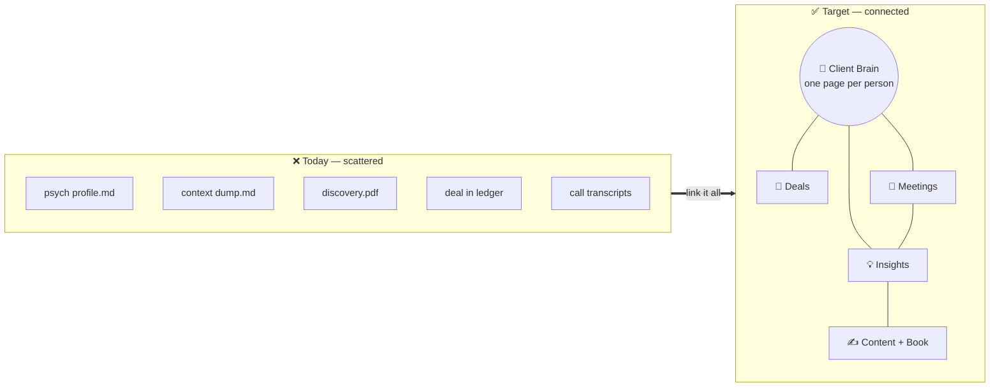

# 🧠 Connect the Dots — Making the System Smarter

> **One idea runs this whole page: stop storing, start linking — and let Iris do the linking.** Your most valuable asset (what you know about your clients and how they think) is scattered across loose files. Scattered means invisible. This page shows how to turn those piles into a *connected* system that makes you sharper, the work better, and Iris genuinely more capable.

<callout icon="💡" color="blue_bg">
	**Why this matters, in one sentence:** Iris is only as smart as what you can hand her each session — and right now the best stuff never gets handed over because it isn't connected to anything.
</callout>

## 🧩 The mental model (borrowed from Andrej Karpathy) {color="blue_bg"}
---
Karpathy (ex-Tesla/OpenAI, one of the clearest thinkers on how to actually use AI) has a frame that makes this concrete. Think of an AI like Iris as a computer:
<table fit-page-width="true" header-row="true">
<tr><td>**Computer part**</td><td>**Iris equivalent**</td><td>**What it means for you**</td></tr>
<tr><td>CPU</td><td>The Claude model</td><td>The raw thinking power — already excellent</td></tr>
<tr><td>**RAM (working memory)**</td><td>**The context she loads each session**</td><td>Small and precious. Only what's loaded can shape her answer.</td></tr>
<tr><td>Disk (storage)</td><td>Your Notion + Drive files</td><td>Vast — but useless until it's *retrieved* into RAM</td></tr>
</table>

<callout icon="🎯" color="green_bg">
	**The punchline:** your client psychology, your decisions, your best insights are sitting on "disk" that never loads into "RAM." Karpathy calls the skill of loading the right things **"context engineering — the delicate art of filling the context window with just the right information for the next step."** Every move on this page is context engineering: making the good stuff *connected and loadable*.
</callout>

**Karpathy's "LLM Wiki" — the division of labor that makes this work (open for the sourced idea)**

	In early 2026 Karpathy sketched a pattern where an AI maintains a living, interlinked knowledge base for you. His division of labor:
	> *"The human's job is to curate sources, direct the analysis, ask good questions, and think about what it all means. The LLM's job is everything else."*
	Three operations run it: **Ingest** (fold new material into linked pages), **Query** (answer, then *save the valuable discovery back as a new note*), and **Lint** (health-check for contradictions, stale info, and orphaned/unlinked notes). The whole thing *compounds* — every call and every question makes it richer. That's the target state for your Notion, with Iris as the "LLM" and you as the curator/thinker.
	Sources: Karpathy's [LLM Wiki gist](https://gist.github.com/karpathy/442a6bf555914893e9891c11519de94f) · [context-engineering post](https://x.com/karpathy/status/1937902205765607626) · [append-and-review note](https://karpathy.bearblog.dev/the-append-and-review-note/). *(Note: "second brain" is Tiago Forte's term, not Karpathy's — the durable, sourced idea here is the human-curates / AI-links division of labor and the query→save-back loop.)*

## 🕸️ The picture: from scattered files to a connected brain {color="blue_bg"}
---
Today (left) everything about a client lives in separate, unlinked files. The target (right) is a web where one node connects to everything, and Iris can walk the links for you.

## 🏗️ The moves, grouped by what they unlock {color="blue_bg"}
---
Twelve moves. Each is **Build → Why it connects dots → Payoff.** They're grouped so you can see the shape; the "start here" table at the bottom says what to do first.

### Group A — The Client Brain & the relation web (the foundation) {color="blue"}
<table fit-page-width="true" header-row="true">
<tr><td>**Move**</td><td>**Build**</td><td>**Payoff**</td></tr>
<tr><td>**1. The Client Brain**</td><td>One rich page per person that rolls up *everything*: psych profile, every deal, every meeting, every commitment, every idea they sparked</td><td>Iris loads **one** page and knows the whole person. You never re-read five files before a call. Highest-leverage move.</td></tr>
<tr><td>**2. The relation web**</td><td>Explicit links: Contact ↔ Deal ↔ Meeting ↔ Insight ↔ Content, both directions</td><td>The graph Iris walks. "What do I know about how they decide, and which open deals does it touch?" becomes one hop.</td></tr>
<tr><td>**8. Psych profile as structure**</td><td>Convert profiles from prose into consistent fields (decision style, motivators, landmines, comms preference, current read) + a log</td><td>Iris can reason across *all* clients ("who's consensus-driven?"), not just read one at a time.</td></tr>
<tr><td>**11. No-orphan hygiene**</td><td>Every meeting links a contact + deal; every insight links its source; a view flags anything unlinked</td><td>Guarantees Iris sees the *whole* picture on a traversal, not a lucky subset.</td></tr>
</table>

### Group B — The Insight layer & the book (where value compounds) {color="blue"}
<table fit-page-width="true" header-row="true">
<tr><td>**Move**</td><td>**Build**</td><td>**Payoff**</td></tr>
<tr><td>**3. Decisions & Insights DB**</td><td>An atomic database where each row is one decision or insight (client, why, confidence, source). Iris files a new row every session</td><td>Ephemeral chat conclusions become a durable, queryable memory. A decision log your ADHD brain can't hold — and Iris queries instead of re-deriving.</td></tr>
<tr><td>**4. Transcripts → atomic insights**</td><td>Each session, Iris distills a transcript into 3–7 linked insight rows tagged to client + theme + book chapter</td><td>Meetings stop being dead archives and become building blocks. The book's raw material supplies itself.</td></tr>
<tr><td>**5. The book as a "Map of Content"**</td><td>One page per chapter that's a live filtered view of the Insights DB for that theme</td><td>The book is never a blank page — it's always the current distillation of everything you've learned.</td></tr>
<tr><td>**12. Cross-client "Pattern" notes**</td><td>A note type for recurring themes ("founders who over-index on speed," "pre-signature cold feet") linked to every client who shows it</td><td>Your genuine IP — insight that only exists *between* clients, invisible in any single profile. This is thought-leadership fuel.</td></tr>
</table>

### Group C — Iris's routines & frictionless capture (the engine) {color="blue"}
<table fit-page-width="true" header-row="true">
<tr><td>**Move**</td><td>**Build**</td><td>**Payoff**</td></tr>
<tr><td>**6. Glance-rollups**</td><td>On each Client Brain/Deal: # open commitments, days since last contact, unresolved insights, psych-flag count</td><td>One number encodes many facts. ADHD-friendly single-glance status; Iris gets clean signals ("3 clients gone quiet").</td></tr>
<tr><td>**7. Iris Session Context page**</td><td>One dashboard Iris reads first each session: active deals, this week's meetings, open decisions, "needs attention," links to Client Brains</td><td>Context engineering applied to startup — Iris begins every session oriented, not guessing what to load.</td></tr>
<tr><td>**9. Ingest / Query / Lint routines**</td><td>Iris jobs: fold in new material, file discoveries back, and weekly *lint* for contradictions, stale contacts, orphaned insights</td><td>The system self-heals and compounds instead of rotting. Lint is what hunts the *missing* links.</td></tr>
<tr><td>**10. Frictionless capture inbox**</td><td>One always-open note/DB to dump any thought with zero categorizing; Iris sorts and links it later</td><td>ADHD-critical: capture costs nothing, so nothing is lost between the impulse and the structure. (This is literally Karpathy's own note system.)</td></tr>
</table>

## 🥇 If you start anywhere, start here {color="blue_bg"}
---
<callout icon="🚀" color="green_bg">
	**The three that unlock the most, in order:**
	**1.** Build the **Client Brain (#1) + relation web (#2)** — the foundation everything else hangs on.
	**2.** Stand up the **Decisions & Insights DB (#3)** and point Iris's session loop at it — this is where the compounding starts.
	**3.** Add the **Iris Session Context page (#7)** so every session loads the right stuff automatically.
	Everything else layers on once these three exist. This is also exactly what makes your **delivery hub** and **client consolidation** work — see the Delivery Hub redesign page.
</callout>

<callout icon="🔗" color="gray_bg">
	**The throughline:** Iris is only as smart as the context you can load, and value lives in the connections. So the whole plan is one instruction — **stop storing, start linking, and let Iris do the linking, linting, and filing-back.** That turns your scattered files into a compounding brain that makes you smarter, the work better, and Iris materially more capable.
</callout>
