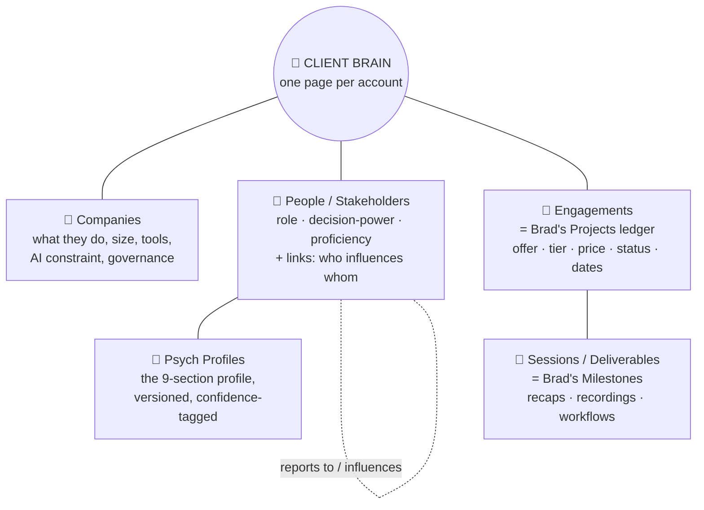
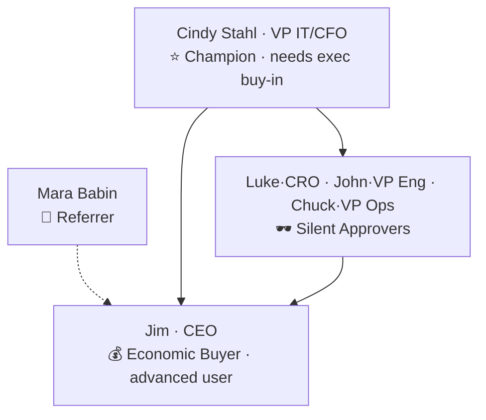

# 🚚 Delivery Hub + Client Brain — The Redesign

> **The goal in one line:** one place per client that holds *everything* — what they do, who the decision-makers are, how each of them thinks, the deal, and every session — so you (and Iris) get the whole picture at a glance instead of digging through fifteen files. This keeps the best of Brad's build and finally makes the delivery side work the way you actually work.

<callout icon="🎯" color="green_bg">
	**What you asked for:** *"a single view of the business, what they do, map the decision-makers, house psych profiles… house everything in Notion in one place so information is consolidated."* That's exactly what this designs. Today that intelligence is gold — but it's trapped in loose markdown files. This turns it into a connected system.
</callout>

## 🔴 The problem, honestly {color="blue_bg"}
---
Your client intelligence is genuinely excellent — the psych profiles, context dumps, and call-prep docs are a real edge. But they live as **loose files in Drive folders**, and that creates four quiet taxes:
<table fit-page-width="true" header-row="true">
<tr><td>**The tax**</td><td>**What it looks like**</td></tr>
<tr><td>**No relational spine**</td><td>People, companies, deals, sessions are prose *inside documents*, not linked records. You can't ask "show me all economic buyers" or "every deal in Discovery."</td></tr>
<tr><td>**Duplication & drift**</td><td>Cindy's budget is "\$5–10K" in one file, "\$20K okay" in another, "\$15K" in the SOW. The same facts, re-typed across 3–5 files, quietly falling out of sync.</td></tr>
<tr><td>**Psych profiles siloed**</td><td>Every client independently wants "hands-on, real workflows, no generic training" — a priceless pattern, but buried in separate docs so you never see it.</td></tr>
<tr><td>**Delivery state = folders**</td><td>What stage a client is in is *inferred from which subfolders exist* (Discovery / Day 1 / Final Deliverables), not tracked anywhere you can see at a glance.</td></tr>
</table>

## 🟢 The design: the "Client Brain" {color="blue_bg"}
---
Keep Brad's project-centric spine. Add the intelligence layer on top. Five linked databases, one page per client that pulls it all together.

<callout icon="🧠" color="purple_bg">
	**What one Client Brain page shows you at a glance** (say, Conquest / Cindy):
	**Top:** company one-liner (fire-rated duct manufacturer, union shop, M1 ERP, Claude platform) · deal status + value (\$15K, In Delivery) · next date.
	**Decision-makers:** Cindy (Champion, needs exec sign-off) · Jim/CEO (Economic Buyer, advanced user) · the exec team (Silent Approvers) · Mara Babin (Referrer) — each linked, each with a proficiency level.
	**The psychology:** Cindy's one-line read + her Always/Never list, pulled from her profile.
	**Delivery:** the 5 sessions, recaps, target workflows (AutoCAD→Excel→M1), governance-review status.
	One page. No digging.
</callout>

## 🗂️ The five databases (what goes where) {color="blue_bg"}
---
Open each to see the fields — kept in toggles so this stays scannable.

**🏢 Companies** — what they do

	Industry · what they do · HQ + sites · size (headcount, team size) · revenue/growth mode · ownership (union, PE, startup) · core systems (ERP, M365) · **AI tooling constraint** (Claude / ChatGPT / Copilot-only — this dictates the curriculum) · AI governance maturity · existing AI adoption · key operational pain. Relation → People, Engagements.

**👤 People / Stakeholders** — map the decision-makers

	Name · role/title · **Stakeholder role** (Select: Economic Buyer · Champion · Blocker · Sponsor · Silent Approver · End User · Referrer) · AI proficiency (1–4) · **reports-to / influences** (a relation *to itself* — this is what builds the org map) · approval authority / budget ceiling · contact info · adoption stance · link to their psych profile. This single Select turns "who decides, who blocks" into a one-click view.

**🧬 Psych Profiles** — how each person thinks

	One page per person, the 9 canonical sections from your prompt: **1** Who they are · **2** How they communicate · **3** How they decide · **4** What motivates them · **5** What they fear/avoid · **6** How to influence them (Always / Never lists) · **7** Communication preferences · **8** Client Desire Map (Hopes / Fears / Barriers) · **9** Notable quotes. Plus structured **Confidence** tags (High/Med/Low/Needs-data), **Version**, and **Sources**. Versioned living document — re-run after each call.

**💼 Engagements** — the deal (this IS Brad's Projects ledger, not a new thing)

	Offer type (Team Sprint · On-site · 1:1 · Advisory Retainer · SME/Licensing) · tier · price · stated budget · economic-buyer relation · **status** (Lead → Diagnostic → Proposal → Verbal Yes → Signed → Discovery → In Delivery → Wrap → Follow-on) · key dates · payment terms · referral source · Fathom links · guarantee · case-study rights. **We reuse your existing ledger — just enrich it.**

**📅 Sessions / Deliverables** — the delivery (this IS Brad's Milestones)

	Session title · length · date · recap · recording · target workflows · cohort size · format (virtual/on-site/hybrid) · archetypes present · capability assessment (baseline/mid/post) · governance-deliverable status · deliverables checklist · outcomes/proof points (\$2M saved via RFQ tool). **Reuses Brad's milestone engine** — including auto-build on Won.

## 🗺️ Mapping the decision-makers (the part you specifically want) {color="blue_bg"}
---
The **People database links to itself** ("reports to / influences"), so each account gets a real stakeholder map you can *see* and *filter* — not narrative buried in a doc. Example, Conquest:

With the Stakeholder-role Select in place, one filtered view answers *"who's the economic buyer / who can block this"* for every account instantly.

## 🔧 The delivery pipeline as visible stages {color="blue_bg"}
---
Your real workflow (reverse-engineered from all four clients) becomes a **status field**, so the board shows exactly where every client is — no more reading folder names.
<table fit-page-width="true" header-row="true">
<tr><td>**Stage**</td><td>**Artifacts it produces**</td></tr>
<tr><td>0 · Lead / Referral</td><td>Referral note, source attribution</td></tr>
<tr><td>1 · Diagnostic (sales)</td><td>Transcript → Context Dump + v1 Psych Profile</td></tr>
<tr><td>2 · Call Prep</td><td>Read, account strategy, objection map, pricing defense</td></tr>
<tr><td>3 · Proposal / SOW</td><td>Tiered proposal → SOW</td></tr>
<tr><td>4 · Contract & Deposit</td><td>Signed SOW, deposit/installments</td></tr>
<tr><td>5 · Discovery (2 wks)</td><td>4 interviews, findings, governance review, context build, baseline</td></tr>
<tr><td>6 · Curriculum / Design Brief</td><td>Design brief, archetype map, real-workflow exercises</td></tr>
<tr><td>7 · Delivery (sessions 1..N)</td><td>Sessions, recordings, recaps, build artifacts, between-session challenges</td></tr>
<tr><td>8 · Midpoint</td><td>Midpoint survey, sponsor check-in</td></tr>
<tr><td>9 · Wrap / Readout</td><td>Post-program report, readout call, 60-day survey</td></tr>
<tr><td>10 · Proof / Follow-on</td><td>Case study, referral ask, scoped next phase</td></tr>
</table>
<callout icon="🔁" color="gray_bg">
	Two sub-tracks run alongside: **Governance & Data Policy** and the **Executive Rhythm** (pre-kickoff / midpoint / readout sponsor calls). Both become simple status fields on the Engagement.
</callout>

## 🧬 Preserve your best asset: the profile engine {color="blue_bg"}
---
<callout icon="⭐" color="green_bg">
	Your `Client_Psychographic_Profile_Prompt.md` is the single most valuable reusable asset in the whole system — it turns a transcript into a confidence-tagged, versioned profile. **We make it a Notion template/button** on the People database: new call → drop transcript → the profile page generates, tagged and versioned. The discipline that makes it great (every inference tagged High/Med/Low, "favor omission over speculation") carries straight in.
</callout>

## 🤝 What we keep from Brad (don't rebuild what works) {color="blue_bg"}
---
<columns>
<column>
<callout icon="✅" color="green_bg">
	**Keep & reuse**
	- The Projects ledger → becomes **Engagements** (enriched, not replaced)
	- Milestones → become **Sessions**, incl. auto-build on Won
	- Meeting auto-linking + coaching-intelligence agent
	- The two-view (Sales / Delivery) idea
</callout>
</column>
<column>
<callout icon="🔧" color="orange_bg">
	**Add / fix**
	- The **People/Stakeholder** layer with roles + org map
	- **Psych Profiles** as structured, versioned pages
	- Company intelligence fields (AI constraint, governance)
	- Delivery **stage** as a status, not a folder
	- The **Client Brain** page that unifies it all
</callout>
</column>
</columns>

## 🛠️ Build plan (what I can do vs. with you) {color="blue_bg"}
---
This is a bigger build than the quick fixes — I'll do it **non-destructively** (new databases alongside your live data; nothing existing gets touched until you're happy).
<table fit-page-width="true" header-row="true">
<tr><td>**Step**</td><td>**Who**</td><td>**Effort**</td></tr>
<tr><td>Stand up the 5-database skeleton (Companies · People · Psych Profiles · Engagements[enrich existing] · Sessions) with the field lists above</td><td>🟢 I build it</td><td>~1 hr</td></tr>
<tr><td>Add the Stakeholder-role Select + the self-referential "influences" relation + saved "who decides / who blocks" views</td><td>🟢 I build it</td><td>20 min</td></tr>
<tr><td>Turn your psychographic prompt into a Notion template/button</td><td>🟢 I build it</td><td>15 min</td></tr>
<tr><td>Migrate the 4 current clients (Amada, Conquest, Rockline, Ziplines) in as the first Client Brains, from the Drive files</td><td>🟡 I draft → you sanity-check the psych reads</td><td>~1 hr</td></tr>
<tr><td>Build one **Client Brain page template** so every new client starts complete</td><td>🟢 I build it</td><td>20 min</td></tr>
<tr><td>Backfill the rest of your clients (needs the fuller local folder synced to Drive)</td><td>🟡 Together, once synced</td><td>scales</td></tr>
</table>

<callout icon="🚀" color="green_bg">
	**Recommended first move:** let me build the skeleton + migrate **Conquest and Rockline** as two worked examples (I already have their full profiles). You'll see the whole idea working on real accounts before we roll it out. Say go and it's done.
</callout>

<callout icon="🔗" color="gray_bg">
	**Where this connects:** the relation web and the "Client Brain aggregates everything" idea come straight from the <mention-page url="PLACEHOLDER_CONNECT">Connect the Dots</mention-page> page (moves #1, #2, #8). The stage cleanup and field discipline dovetail the <mention-page url="PLACEHOLDER_FIXTRACK">Notion Fix Track</mention-page>. And Iris gets dramatically smarter the moment this exists — one Client Brain page is exactly the "load the right context" she needs.
</callout>
